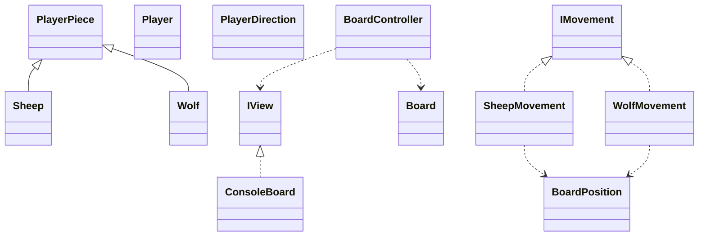

## WolfandSheep

### Authorship

Ricardo Mota | a22402487

### Solution architecture

This project was all about the game Wolf and Sheep which is in an MVC format.

Model :
* Board.cs -Represents the board of the game, including the borders,
            where pieces are and where they move to.
* BoardPosition.cs - Checks if sqaures are valid to enter
* IMovement.cs - Interface which dictates movement for the Sheep and Wolf
* Player.cs - Enumerator which represents the 2 players, also intended to switch
the players after a turn.
* PlayerDirection.cs - Where players can move on the board
* PlayerPiece.cs - Represents a piece on the board, the type or colour
* Sheep/Wolf.cs - What the pieces are and where they can move
* Sheep/WolfMovement.cs - Implements the IMovement interface and checks if piece has been moved.

View :
* ConsoleBoard.cs - Inherits from Interface IView and displays messages to the player
  and the image of the board is meant to as well display the image of the game state.
* IView.cs - The Interface that limits what ConsoleBoard does.
  
Controller : 
* BoardController.cs - Controls what is displayed to the players and the gamestate
  and afterwards meant to display the game over screen.

Non Trivial Algorithms:

* In WolfMovement there also exists the condition that if the from position is
  equal to the to position the game is over.
* Program.cs tries to run the project. 
  

## Mermaid Class Diagram VSCode

### References

My biggest reference of all was a youtube series about
creating a chess game by OttoBotCode which assisted me in the Model part of this project
in particular, another reference was a video about optimal positions and
some AI such as ChatGPT were utilised as a form of guidance to correct
mistakes in logic.
Links :
* OttoBotCode playlist series Link : https://www.youtube.com/playlist?list=PLFk1_lkqT8MahHPi40ON-jyo5wiqnyHsL

* Optimal Positions Link:https://codesignal.com/learn/courses/multidimensional-arrays-and-their-traversal-in-csharp/lessons/identifying-optimal-positions-in-2d-arrays-using-csharp

* WolfandSheep project Github Link:https://github.com/RicardoMota22/ProjDeRecurso